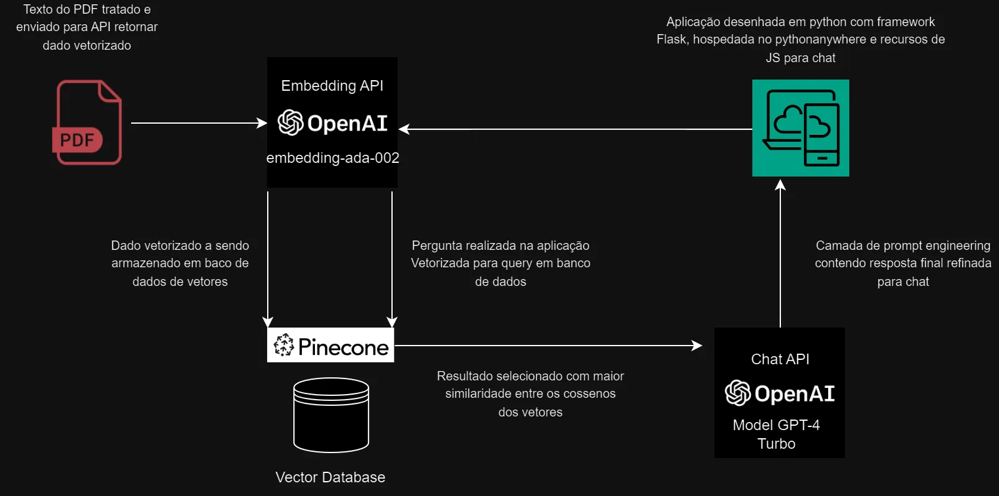

# Inteligência Farmacêutica da Univesp

## O Projeto

Este projeto desenvolve uma plataforma web interativa projetada para descomplicar os termos técnicos encontrados nas bulas de medicamentos, auxiliando indivíduos com dificuldades de compreensão. Empregamos inteligência artificial avançada, incluindo tecnologias de Geração Aumentada de Recuperação (RAG), para facilitar o acesso a informações cruciais como posologia, interações medicamentosas e efeitos colaterais. A implementação integra a API da OpenAI e utiliza bancos de dados de vetores e serviços de cloud computing, assegurando uma operação segura e escalável. Além disso, a plataforma adere rigorosamente às práticas de acessibilidade digital, incorporando scripts em JavaScript para dinamizar a interação no frontend e sistemas de controle de versão para uma gestão eficaz do código.

## Diagrama:





## Implantação:

Crie o ambiente virtual com o venv. Importante instalar a versão do python 3.10 para compatiblidade com as libs do projeto.
```
!sudo python3.10 -m venv rag_univesp
```
Ative o ambiente virutal:
```
!source rag_univesp/bin/activate 
```
Instale as dependências:
```
!pip install -r requirements.txt
```
O comando abaixo inicia a aplicação. Antes de iniciar a aplicação ele roda o script Migrations.py:
```
!python app.py
```
Crie as variáveis de ambiente no root:
```commandline
sudo nano .env
```
```
OPENAI_API_KEY="xxxxxxxxxxxxxxxxxxxxxxxxxxxxxxxxxxxxxxxxxxxxxxxxx"
PINECONE_API_KEY="xxxxxxxxxxxxxxxxxxxxxxxxxxxxxxxxxxxxxxxxxxxxxxxxx"
PINECONE_INDEX_NAME="xxxxxxxxxxxxxxxxxxxxxxxxxxxxxxxxxxxxxxxxxxxxxxxxx"
```

## Alimentando o banco de dados:

- Abra o arquivo [embeddings.py](resource/embeddings.py)
- Ajuste o linha com o caminho do PDF a ser vetorizado
- Ajuste a linha com o nome do medicamento no campo metadado do pinecone chamado "medicine".

